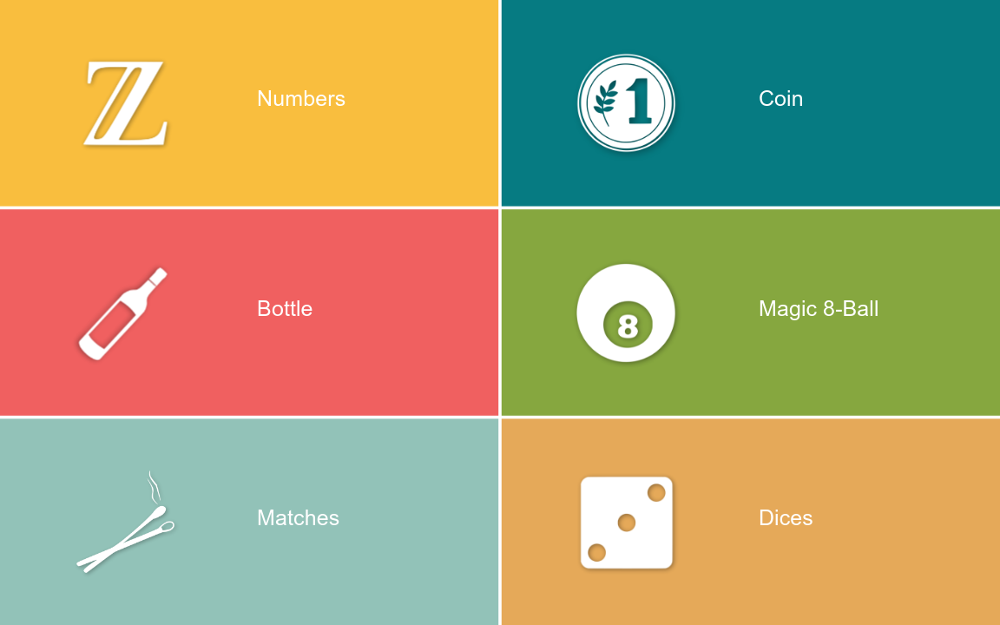

# Randomizer App

Ultimate randomizer mobile/web application created with [Expo](https://expo.dev), [react-native](https://reactnative.dev/) and [react-native-web](https://github.com/necolas/react-native-web).

## Repository structure

* [`app`](app) - the current application (Expo, TypeScript), see [app/README.md](app/README.md) for how to run and build it in Expo Cloud (EAS) or locally with prebuild
* [`app-old`](app-old) - the previous version of the application (react-native 0.62, webpack) kept for reference

## Features

* Get a random number
* Flip the coing
* Spin the bottle
* Ask yes/no question
* Pull a burned match
* Throw dices

## License

Randomizer is [GNU GPLv3 licensed](LICENSE)
