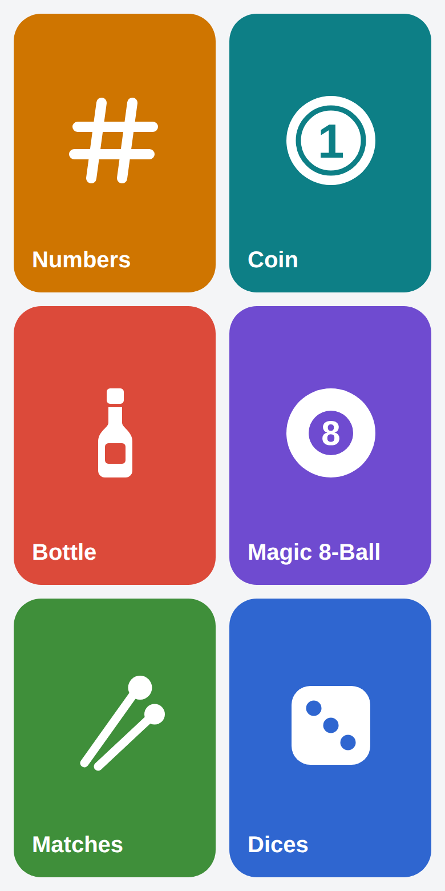

# Randomizer App

Ultimate randomizer mobile/web application created with [Expo](https://expo.dev), [react-native](https://reactnative.dev/) and [react-native-web](https://github.com/necolas/react-native-web).

## Features

* Get a random number
* Flip the coin
* Spin the bottle
* Ask yes/no question
* Pull a burned match
* Throw dices
* Pick a card from a shuffled deck
* Split players into random teams

## License

Randomizer is [GNU GPLv3 licensed](LICENSE)
